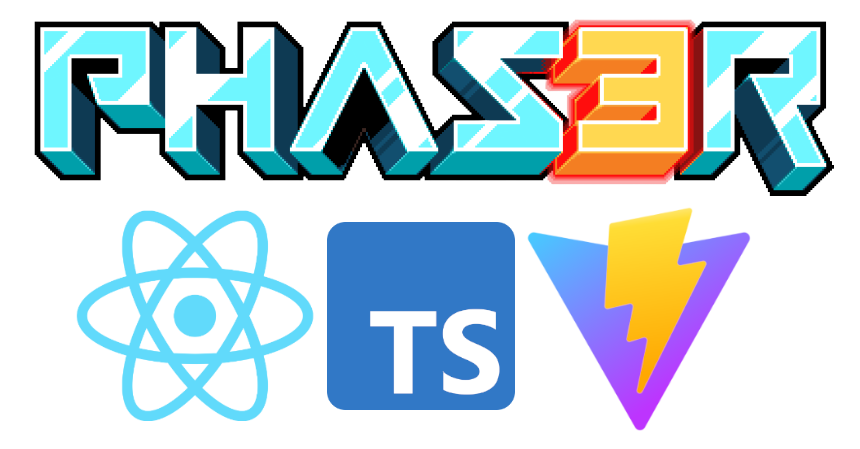

# Phaser 3 Starter (React + Typescript + Vite)



This is a template to create a game with [Phaser 3](https://phaser.io/phaser3) using typescript, embedded in a React app, packaged with [Vite](https://vitejs.dev/guide/).

## Getting started

**Installation**

```bash
git clone git@github.com:Firnael/phaser-react-ts-vite-starter.git new-game
cd new-game
npm install
```

**Run (dev)**

```bash
# launches a server on http://localhost:3000
# HMR enabled by default
npm run dev
```

**Build (production)**

```bash
# creates a 'dist' folder
npm run build
```

## License

Copyright © 2022 Audren Burlot  
This work is free. You can redistribute it and/or modify it under the
terms of the Do What The Fuck You Want To Public License, Version 2,
as published by Sam Hocevar. See the [LICENSE](LICENSE) file for more details.

<a href="http://www.wtfpl.net/"></a>